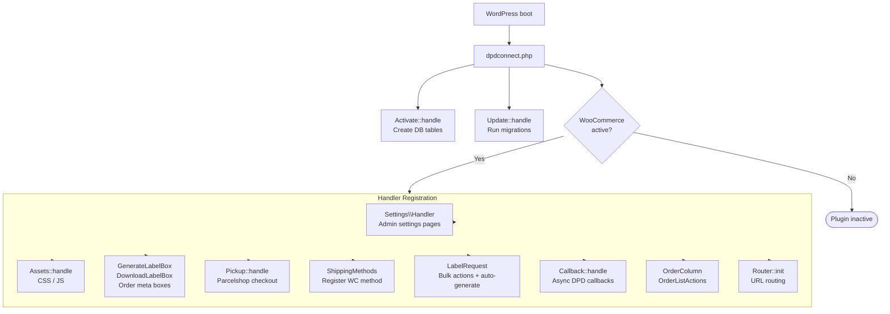
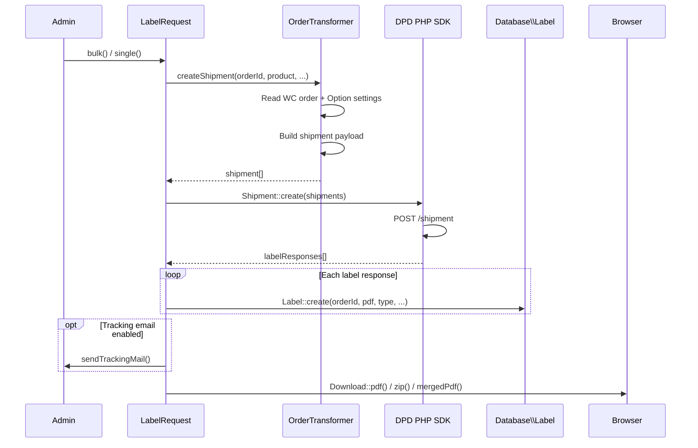
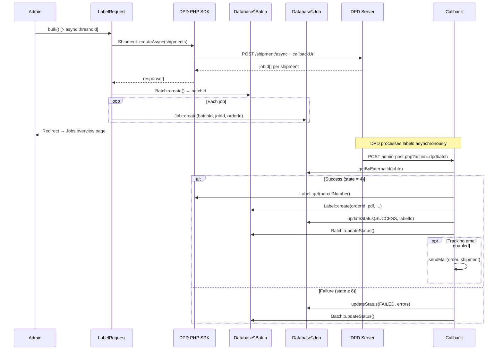
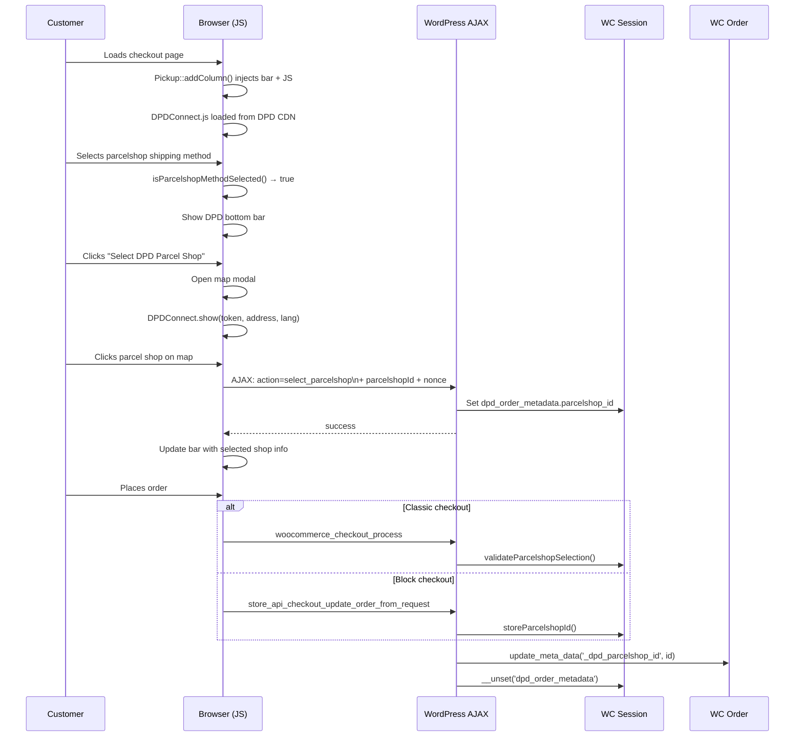

<!--
DOCS_METADATA:
  generated_at: 2026-02-19T10:35:27Z
  git_hash: 8a785aa
  tool_version: 1.0.0
  source_command: /create-documentation
-->

# Architecture

<!-- AUTO-GENERATED:START - Do not edit manually -->

## Overview

DPD Connect for WooCommerce is a standard WordPress plugin that integrates with the DPD Connect REST API via the `dpdconnect/php-sdk` Composer package.

The plugin follows a **handler-based architecture**: each area of functionality is encapsulated in a static handler class that registers WordPress action/filter hooks during plugin initialization. There is no persistent runtime state — all processing happens within request scope.

---

## Plugin Initialization

---

## Sync Label Creation Flow

---

## Async Label Creation Flow

---

## Parcelshop Checkout Flow

---

## External Dependencies

| Package | Purpose |
|---|---|
| `dpdconnect/php-sdk` | DPD Connect REST API client |
| `myokyawhtun/pdfmerger` | Merging multiple PDFs into one file |

<!-- AUTO-GENERATED:END -->

<!-- MANUAL:START - Safe to edit, preserved on updates -->
<!-- Add custom notes below -->
<!-- MANUAL:END -->
