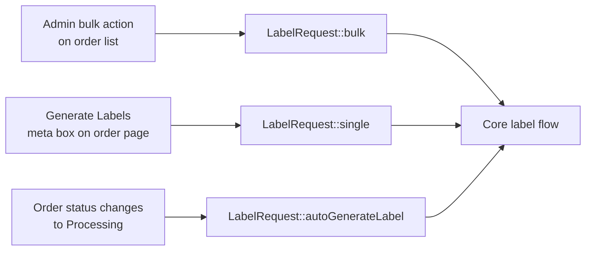
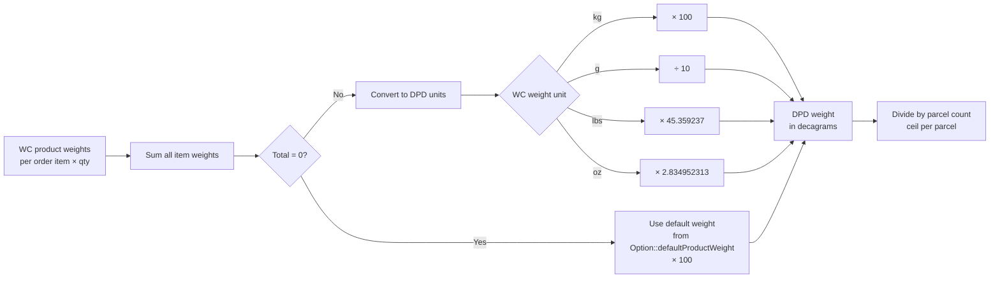
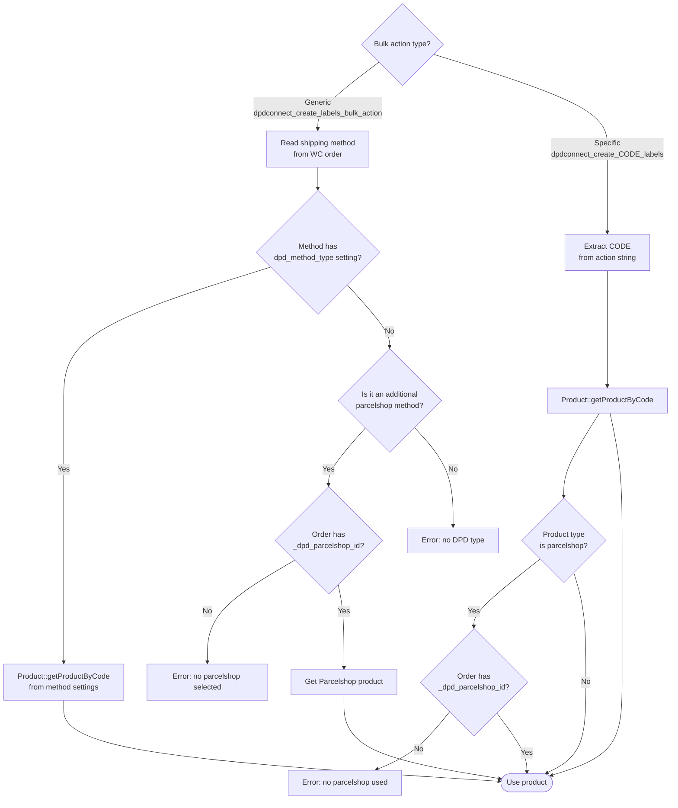
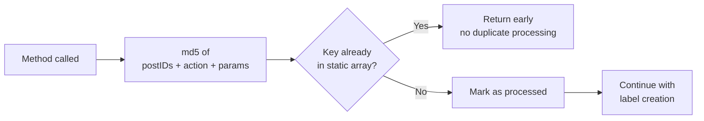

<!--
DOCS_METADATA:
  generated_at: 2026-02-19T10:35:27Z
  git_hash: 8a785aa
  tool_version: 1.0.0
  source_command: /create-documentation
-->

# Label Creation Flow

<!-- AUTO-GENERATED:START - Do not edit manually -->

## Entry Points

There are three triggers that initiate label creation:



---

## Complete Label Decision Flow

```mermaid
flowchart TD
    Start([Label request]) --> FF{Order contains\nFresh/Freeze items?}

    FF -- Yes, no dates yet --> Redirect[Redirect to\nFresh/Freeze date form]
    FF -- No / dates provided --> Group[Group order items\nby shipping product]

    Group --> Loop[For each shipping\nproduct group]

    Loop --> Validate[OrderValidator\nvalidateReceiver + validateProduct]
    Validate --> Valid{Valid?}
    Valid -- No --> Error[Notice::add error\nRedirect to orders list]
    Valid -- Yes --> Transform[OrderTransformer::createShipment\nBuild shipment payload]

    Transform --> ProductType{Product type?}
    ProductType -- Fresh/Freeze --> FFParcels[createFreshFreezeParcels\nwith expiry dates per item]
    ProductType -- Parcelshop --> PSCheck{Parcelshop ID\nin order meta?}
    PSCheck -- No --> Error
    PSCheck -- Yes --> AddPS[Add parcelshopId\n+ notifications]
    ProductType -- Predict/Saturday --> AddNotify[Add predict\nEMAIL notification]
    ProductType -- Standard/B2B --> BuildParcels[Build standard parcels\nwith weight + volume]

    FFParcels --> Customs[addCustomsToShipment\nHS codes, origin, values]
    AddPS --> Customs
    AddNotify --> Customs
    BuildParcels --> Customs

    Customs --> Threshold{Count ≤\nasync threshold?}

    Threshold -- Yes\nSync --> Sync[Shipment::create\nPOST /shipment]
    Threshold -- No\nAsync --> Async[Shipment::createAsync\nPOST /shipment/async]

    Sync --> SyncResp[labelResponses[]]
    SyncResp --> StorePDF[Database\\Label::create\nStore PDF blob per label]
    StorePDF --> TrackEmail{Tracking email\nenabled?}
    TrackEmail -- Yes --> SendEmail[sendTrackingMail]
    TrackEmail -- No --> Download
    SendEmail --> Download[Download::pdf / zip / mergedPdf]

    Async --> CreateBatch[Database\\Batch::create]
    CreateBatch --> CreateJobs[Database\\Job::create\nper shipment]
    CreateJobs --> RedirectJobs[Redirect → Jobs overview]
```

---

## Weight Calculation



---

## Product Resolution

How the plugin determines which DPD product to use for a label:



---

## Duplicate Prevention

Both `bulk()` and `single()` guard against being called twice in the same request (WooCommerce may fire both old and new HPOS bulk action hooks simultaneously):



<!-- AUTO-GENERATED:END -->

<!-- MANUAL:START - Safe to edit, preserved on updates -->
<!-- Add custom notes below -->
<!-- MANUAL:END -->
