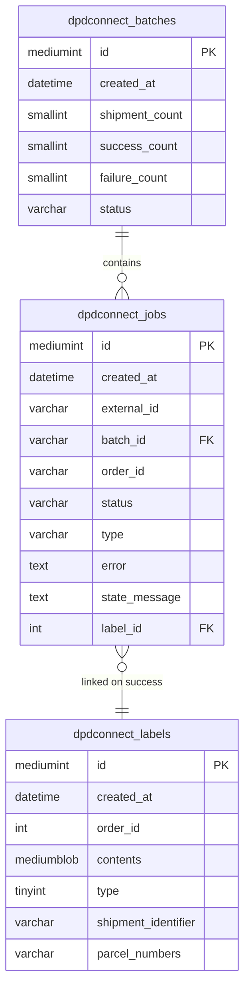
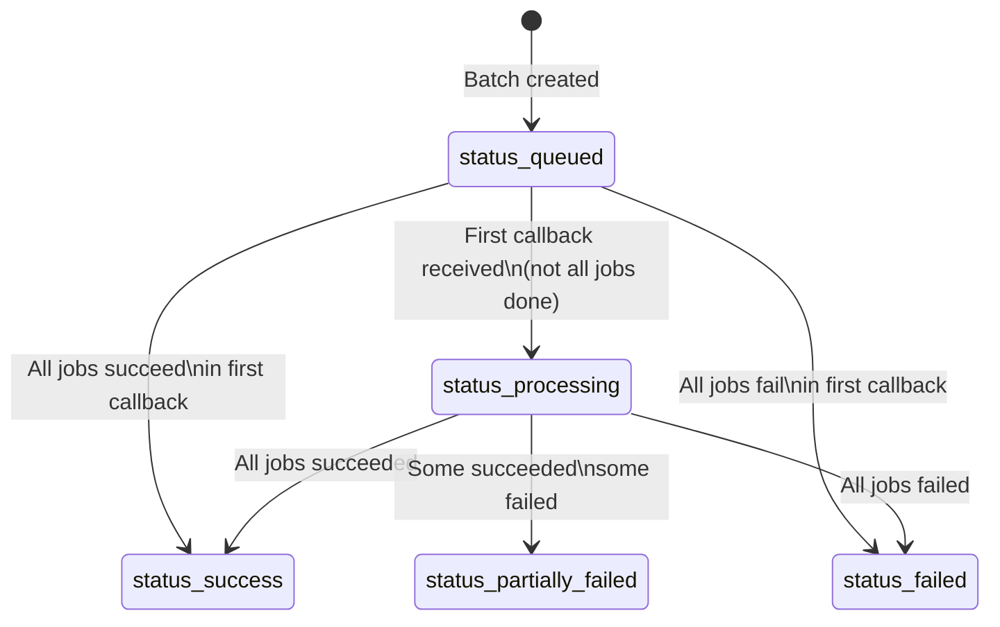

<!--
DOCS_METADATA:
  generated_at: 2026-02-19T10:35:27Z
  git_hash: 8a785aa
  tool_version: 1.0.0
  source_command: /create-documentation
-->

# Database Schema

<!-- AUTO-GENERATED:START - Do not edit manually -->

## Overview

The plugin creates three custom tables on activation via `Handlers\Activate::updateDb()`. Tables use the WordPress table prefix (`$wpdb->prefix`, typically `wp_`).

---

## Entity Relationship Diagram



---

## `{prefix}dpdconnect_labels`

Stores generated shipping label PDFs as binary blobs.

| Column | Type | Notes |
|---|---|---|
| `id` | `mediumint(9)` AUTO_INCREMENT | Primary key |
| `created_at` | `datetime` DEFAULT CURRENT_TIMESTAMP | Creation timestamp |
| `order_id` | `int(11)` NOT NULL | WooCommerce order ID |
| `contents` | `mediumblob` NOT NULL | Raw PDF binary |
| `type` | `tinyint` NOT NULL | `0` = regular, `1` = return (see `ParcelType`) |
| `shipment_identifier` | `varchar(255)` NOT NULL | DPD shipment identifier |
| `parcel_numbers` | `varchar(255)` NOT NULL | Comma-separated DPD parcel numbers |

**Indexes:**
- `PRIMARY KEY (id)`
- `INDEX created_at`
- `INDEX order_id_type_created_at (order_id, type, created_at)`

**PHP class:** `Database\Label`

**Key methods:**
- `create($orderId, $contents, $type, $shipmentIdentifier, $parcelNumbers)` → returns insert ID
- `get($id)` → returns single row
- `getByOrderId($orderId, $type, $returnAll = false)` → returns most recent label or all (up to 5)

---

## `{prefix}dpdconnect_batches`

Tracks async label generation batches.

| Column | Type | Notes |
|---|---|---|
| `id` | `mediumint(9)` AUTO_INCREMENT | Primary key |
| `created_at` | `datetime` DEFAULT CURRENT_TIMESTAMP | Creation timestamp |
| `shipment_count` | `smallint(5)` NOT NULL | Total jobs in this batch |
| `success_count` | `smallint(5)` DEFAULT 0 | Jobs completed successfully |
| `failure_count` | `smallint(5)` DEFAULT 0 | Jobs that failed |
| `status` | `varchar(255)` NOT NULL | See `BatchStatus` enum |

**Indexes:**
- `PRIMARY KEY (id)`
- `INDEX created_at`

**PHP class:** `Database\Batch`

**Batch status values** (`BatchStatus` enum):

| Constant | Value | Meaning |
|---|---|---|
| `STATUSQUEUED` | `status_queued` | Submitted, no callbacks yet |
| `STATUSPROCESSING` | `status_processing` | Some callbacks received, not all done |
| `STATUSSUCCESS` | `status_success` | All jobs succeeded |
| `STATUSFAILED` | `status_failed` | All jobs failed |
| `STATUSPARTIALLYFAILED` | `status_partially_failed` | Mix of success and failure |



**Key methods:**
- `create($shipments)` → creates batch record, returns batch ID
- `updateStatus($job)` → recalculates and updates batch status based on job outcomes

---

## `{prefix}dpdconnect_jobs`

Tracks individual shipment jobs within an async batch.

| Column | Type | Notes |
|---|---|---|
| `id` | `mediumint(9)` AUTO_INCREMENT | Primary key |
| `created_at` | `datetime` DEFAULT CURRENT_TIMESTAMP | Creation timestamp |
| `external_id` | `varchar(255)` NOT NULL | Job ID assigned by DPD Connect API |
| `batch_id` | `varchar(255)` NOT NULL | References `dpdconnect_batches.id` |
| `order_id` | `varchar(255)` NOT NULL | WooCommerce order ID |
| `status` | `varchar(255)` NOT NULL | See `JobStatus` enum |
| `type` | `varchar(255)` NOT NULL | `0` = regular, `1` = return |
| `error` | `text` | Serialized error data on failure |
| `state_message` | `text` | DPD state message on failure |
| `label_id` | `int(11)` | References `dpdconnect_labels.id` on success |

**Indexes:**
- `PRIMARY KEY (id)`
- `INDEX created_at`
- `INDEX batch_id`
- `INDEX order_id_type_created_at (order_id, type, created_at)`

**PHP class:** `Database\Job`

**Job status values** (`JobStatus` enum):

| Constant | Value | Meaning |
|---|---|---|
| `STATUSQUEUED` | `status_queued` | Created, awaiting DPD callback |
| `STATUSPROCESSING` | `status_processing` | DPD is processing |
| `STATUSSUCCESS` | `status_success` | Label generated and stored |
| `STATUSFAILED` | `status_failed` | DPD returned an error |
| `STATUSREQUEST` | `status_request` | Callback received, label download failed |

```mermaid
stateDiagram-v2
    [*] --> status_queued : Job::create()
    status_queued --> status_success : Callback state=4\nLabel fetched + stored
    status_queued --> status_failed : Callback state≥8\nDPD error
    status_queued --> status_request : Callback state=4\nbut label download failed
    status_request --> status_success : Manual retry
```

**Key methods:**
- `create($batchId, $externalId, $orderId, $type)`
- `getByExternalId($externalId)` → used by callback handler to find the job
- `getByOrderId($orderId, $type)` → used to check existing job for an order
- `updateStatus($job, $status, $stateMessage, $errors, $labelId)`

---

## WordPress Options (wp_options)

All plugin settings are stored in the WordPress options table:

| Option key | Used by |
|---|---|
| `dpdconnect_user_credentials` | `Option::connectUsername()`, `Option::connectPassword()` |
| `dpdconnect_general` | Account type, depot, label format, tracking email, download format, package type |
| `dpdconnect_company_info` | All company/sender fields, VAT, EORI, HMRC, customs terms |
| `dpdconnect_products` | Default HS code, origin country, product weight |
| `dpdconnect_parcelshop` | Google Maps key, use DPD key, additional parcelshop methods |
| `dpdconnect_advanced` | Connect URL, callback URL, async threshold, auto-generate flags |

Settings are accessed exclusively via the `Option` class to provide a single point of truth.

<!-- AUTO-GENERATED:END -->

<!-- MANUAL:START - Safe to edit, preserved on updates -->
<!-- Add custom notes below -->
<!-- MANUAL:END -->
