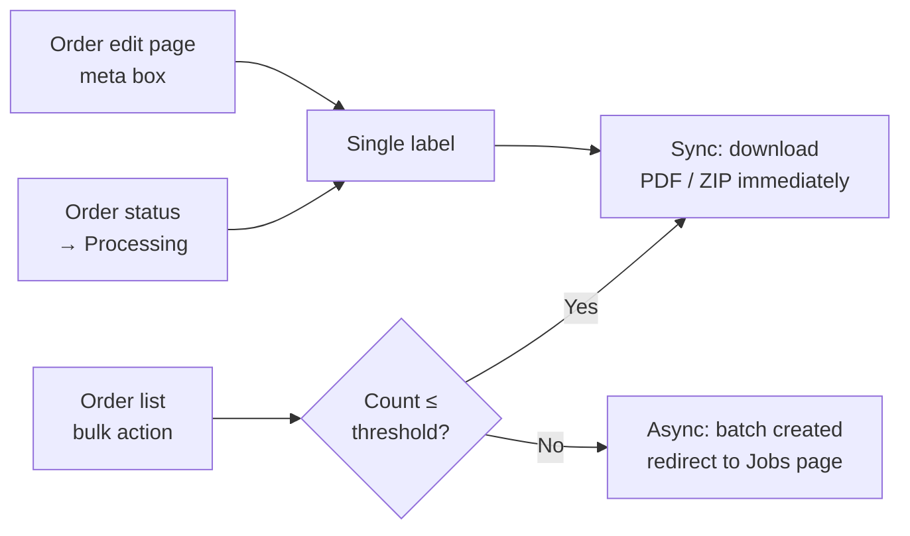

<!--
DOCS_METADATA:
  generated_at: 2026-02-19T10:35:27Z
  git_hash: 8a785aa
  tool_version: 1.0.0
  source_command: /create-documentation
-->

# Creating Labels

<!-- AUTO-GENERATED:START - Do not edit manually -->

## Methods

Labels can be created in three ways:
1. **Single label** — from the individual order edit page.
2. **Bulk labels** — from the order list using bulk actions.
3. **Automatic** — when an order status changes to Processing (if auto-generate is enabled in Advanced Settings).

---

## Single Label (from Order Edit Page)

1. Open an order in **WooCommerce → Orders → [Order]**.
2. In the right sidebar, find the **DPD Connect Generate Labels** meta box.
3. Configure:
   - **Number of parcels** — enter `1` or more (for multi-parcel shipments).
   - **Label type** — select the DPD product. Options include:
     - `Create DPD Labels` — uses the DPD product configured on the order's shipping method.
     - Per product: `Create DPD [Product Name] Labels` — forces a specific DPD product regardless of shipping method.
   - **Parcel type** — `Small Parcel` (15×10×10 cm) or `Normal Parcel` (100×50×50 cm).
4. Click **Generate labels**.

The label PDF is downloaded immediately in the browser.

---

## Bulk Labels (from Order List)

1. Go to **WooCommerce → Orders**.
2. Select one or more orders using the checkboxes.
3. In the **Bulk actions** dropdown, select a DPD action, for example:
   - `Create DPD Labels` — auto-detects the DPD product from each order's shipping method.
   - `Create DPD [Product Name] Labels` — creates labels of a specific DPD product type for all selected orders.
4. Click **Apply**.

### Sync vs Async Processing

The number of orders selected determines how labels are created:

| Orders selected | Processing mode |
|---|---|
| ≤ async threshold (default 10) | **Synchronous** — labels generated immediately and downloaded as PDF or ZIP. |
| > async threshold | **Asynchronous** — a batch job is created; you are redirected to the Jobs overview page. DPD processes the labels and notifies the plugin via callback when complete. |

### Download Format

Bulk sync downloads use the format set in General Settings:
- **Zip file** — all labels in a single `.zip` archive.
- **Merged PDF** — all labels merged into one PDF file.

---

## Automatic Label on Processing

If **Generate shipping label on Processing** is enabled in Advanced Settings, a label is automatically created when:
- An order changes to `Processing` status (typically after successful payment).
- The order's shipping method contains the word "DPD" (case-insensitive).

Optionally, a return label is also created automatically if **Generate return label on label creation** is also enabled.

---

## Return Labels

A return label can be generated:
- Manually, by selecting `Create DPD RETURN Labels` from the bulk actions or label type dropdown.
- Automatically, if the **Generate return label on label creation** checkbox is enabled.

Return labels use DPD's `RETURN` product type and are stored separately in the database.

---

## Tracking Numbers

After a label is created, the order's DPD parcel numbers are saved to order meta as `dpd_tracking_numbers`. These appear in the **Download Labels** meta box on the order edit page.

---

## Errors During Label Creation

Errors are shown as **WooCommerce admin notices** at the top of the orders page. Common errors:

| Error | Cause |
|---|---|
| `Order has no shipping method` | The order was created without a shipping method. |
| `Shipping method has no DPD type` | A non-DPD method is used and no matching configuration found. |
| `DPD Product could not be found` | The product code in the action is not available on your account. |
| `Please select a parcelshop…` | Parcelshop order but no parcelshop ID was saved. |
| `Order X: [validation message]` | DPD API validation failed for a field (e.g. missing address). |

<!-- AUTO-GENERATED:END -->

<!-- MANUAL:START - Safe to edit, preserved on updates -->
<!-- Add custom notes below -->
<!-- MANUAL:END -->
