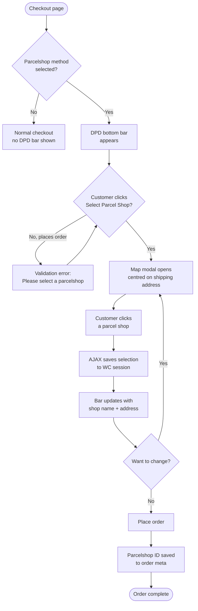

<!--
DOCS_METADATA:
  generated_at: 2026-02-19T10:35:27Z
  git_hash: 8a785aa
  tool_version: 1.0.0
  source_command: /create-documentation
-->

# Parcelshop at Checkout

<!-- AUTO-GENERATED:START - Do not edit manually -->

## Overview

When a customer selects a parcelshop-type shipping method at checkout, the plugin displays a **sticky bottom bar** that prompts them to choose a DPD parcel shop. The bar slides up when a parcelshop method is selected and hides when another method is chosen.

The feature works with both the **WooCommerce Classic Checkout** and the **WooCommerce Blocks Checkout**.

---

## Customer Flow

1. Customer reaches the checkout page.
2. Customer selects a DPD Parcelshop shipping method (or a third-party method configured under Parcelshop Settings → Additional Parcelshop Methods).
3. A fixed bottom bar appears: **"Choose your DPD pickup point"**.
4. Customer clicks **Select DPD Parcel Shop**.
5. A full-screen modal opens with an interactive map.
6. The map pre-centers on the customer's shipping address.
7. Customer clicks a parcel shop on the map to select it.
8. The modal closes; the bottom bar updates to show the selected location (name, address, zip code, city).
9. Customer can click **Change Parcel Shop** to reopen the map.
10. Customer proceeds to place the order.

---

## Validation

A parcelshop **must** be selected before placing the order. If the customer tries to place the order without selecting a parcelshop:

- **Classic checkout**: A WooCommerce error notice is shown and the order is blocked. The DPD bottom bar is highlighted and scrolled into view.
- **Block checkout**: The order submission is intercepted. An error message appears in the bottom bar for 5 seconds.

---

## Technical Notes

- The parcelshop ID is stored in the WooCommerce session (`dpd_order_metadata.parcelshop_id`) after the customer selects a shop.
- On order placement, the parcelshop ID is saved to order meta as `_dpd_parcelshop_id` and the session is cleared.
- The DPDConnect JavaScript library is loaded from the DPD Connect endpoint. It requires network access to DPD's servers.
- A public JWT token is generated **server-side** per checkout page load; credentials are never exposed in the frontend.

---

## Google Maps

The parcelshop map uses Google Maps. Two modes are available:

| Mode | Set in |
|---|---|
| DPD's shared key | Enable **Use DPD's Google Maps API Key** in Parcelshop Settings. |
| Your own key | Disable the checkbox and enter your key in the **Google Maps API Key** field. |

Use your own key for high-traffic stores to avoid rate limiting.

---

## Supported Checkout Types

| Checkout | Support |
|---|---|
| WooCommerce Classic Checkout | Full support — method detection via radio inputs, validation via `woocommerce_checkout_process`. |
| WooCommerce Blocks Checkout | Full support — method detection via block components, validation via `woocommerce_store_api_checkout_update_order_from_request`. |

<!-- AUTO-GENERATED:END -->

<!-- MANUAL:START - Safe to edit, preserved on updates -->
<!-- Add custom notes below -->
<!-- MANUAL:END -->
