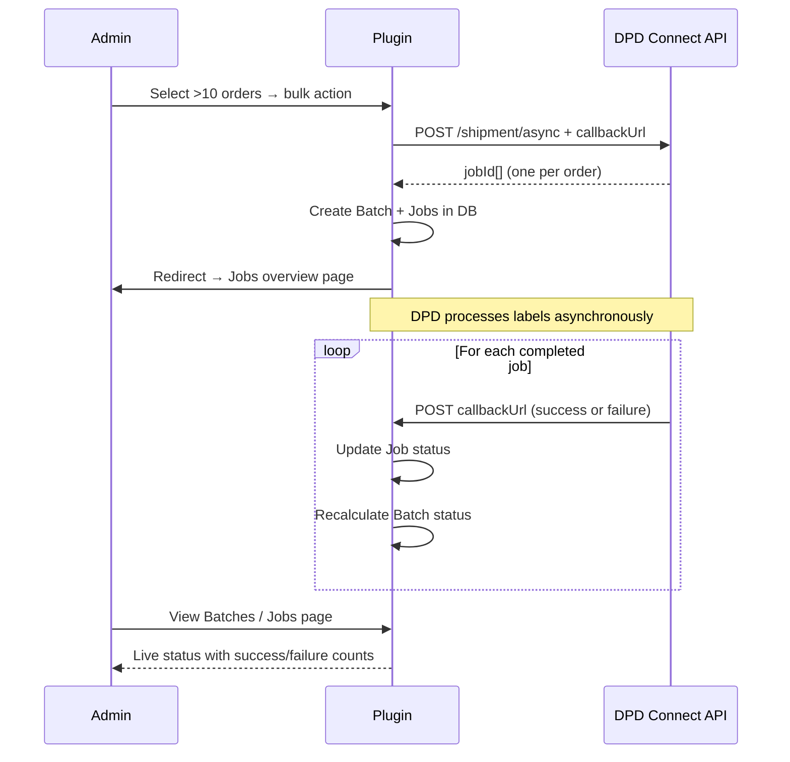
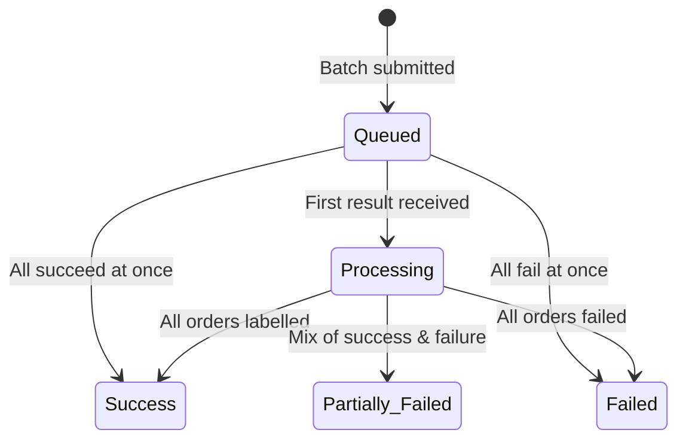

<!--
DOCS_METADATA:
  generated_at: 2026-02-19T10:35:27Z
  git_hash: 8a785aa
  tool_version: 1.0.0
  source_command: /create-documentation
-->

# Batches & Jobs

<!-- AUTO-GENERATED:START - Do not edit manually -->

## Overview

When more orders are selected for bulk label creation than the **async threshold** (default: 10), the plugin switches to asynchronous processing. Instead of waiting for DPD to return all labels immediately, it:

1. Sends all shipments to the DPD Connect API as a single async request.
2. DPD processes each shipment as a **job** in the background.
3. DPD sends results back to the plugin via a **callback URL** for each completed job.
4. The plugin stores results and downloads labels as each job completes.



---

## Batch Overview Page

**WooCommerce → DPD Settings → Batches**

Shows a list of all submitted batches with their current status.

### Batch Statuses

| Status | Description |
|---|---|
| **Queued** | Batch has been submitted to DPD; no jobs have been processed yet. |
| **Processing** | Some jobs have completed; others are still in progress. |
| **Success** | All jobs in the batch completed successfully. |
| **Failed** | All jobs in the batch failed. |
| **Partially Failed** | Some jobs succeeded and some failed. |



### Batch Columns

| Column | Description |
|---|---|
| ID | Internal batch identifier. |
| Created at | Date and time the batch was submitted. |
| Shipment count | Total number of orders/shipments in this batch. |
| Success count | Number of jobs that completed successfully. |
| Failure count | Number of jobs that failed. |
| Status | Current batch status (see above). |

---

## Job Overview Page

**WooCommerce → DPD Settings → Jobs**

Shows individual jobs within a batch. You can also access jobs for a specific batch by clicking the batch ID from the Batches overview page.

### Job Statuses

| Status | Description |
|---|---|
| **Queued** | Job submitted to DPD; awaiting processing. |
| **Processing** | DPD is currently processing this job. |
| **Success** | Label generated successfully; stored in the database. |
| **Failed** | DPD reported an error for this shipment. See the Error column for details. |
| **Request** | The plugin received the callback but failed to download the label PDF. |

### Job Columns

| Column | Description |
|---|---|
| ID | Internal job identifier. |
| External ID | The job ID assigned by DPD Connect. |
| Batch ID | The batch this job belongs to. |
| Order ID | The WooCommerce order this job is for. |
| Type | Parcel type: `0` = regular, `1` = return. |
| Status | Current job status. |
| Error | Error message if the job failed. |
| State message | Additional status message from DPD. |
| Label ID | ID of the stored label in `wp_dpdconnect_labels` (only set on success). |
| Created at | When the job was created. |

---

## Callback Mechanism

The async flow relies on DPD being able to call back your site. The callback URL is:

```
https://yoursite.com/wp-admin/admin-post.php?action=dpdbatch
```

DPD sends a POST request to this URL for each completed job. The plugin processes the result (success or failure) and updates the job and batch status accordingly.

> **Important:** The callback URL must be publicly accessible from DPD's servers. If your WordPress admin is behind a firewall or VPN, configure a custom **Callback URL** in Advanced Settings.

### State Values Processed

| DPD State | Action |
|---|---|
| `4` | Job succeeded — label is fetched and stored. |
| `8` or higher | Job failed — error is stored. |
| `≥ 16` | State 16 is subtracted before checking (fired indicator). |

<!-- AUTO-GENERATED:END -->

<!-- MANUAL:START - Safe to edit, preserved on updates -->
<!-- Add custom notes below -->
<!-- MANUAL:END -->
